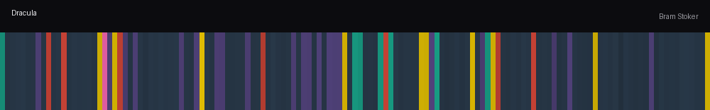
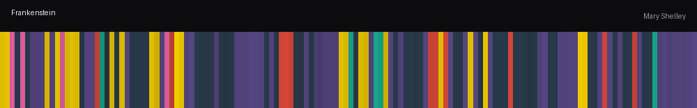
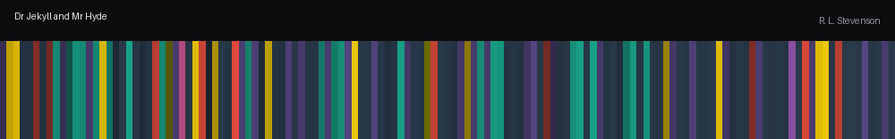
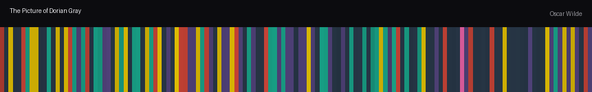
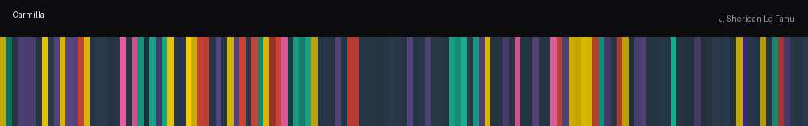
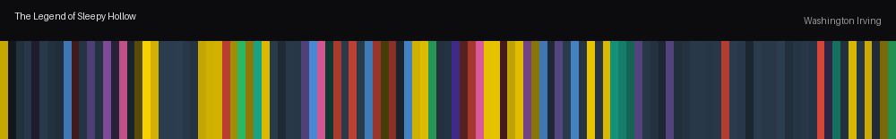

# ◆ Narrative Resonance

**Turn a passage of fiction into its emotional color signature — a palette, an arc across the sentences, and a single-strip fingerprint of the whole text.**

[](https://narrative-resonance.streamlit.app)
[](https://www.python.org/)
[](https://streamlit.io/)
[](LICENSE)



Narrative Resonance reads narrative prose and maps its emotional texture onto color. It is built around a **12-emotion taxonomy tuned for literary feeling** — nostalgia, tenderness, awe, melancholy — rather than the six clinical basics, and around a deliberate, evaluated split between what a neural model reads reliably and what a lexicon reads better.

**▶ Try it live:** **[narrative-resonance.streamlit.app](https://narrative-resonance.streamlit.app)**

---

## What it produces

From any passage you give it, the tool generates five linked views:

- **Color palette** — the text's dominant emotions rendered as a harmonized set of swatches, exportable as CSS variables.
- **Emotional arc** — a sentence-by-sentence line chart of how each emotion rises and falls across the text.
- **Fingerprint** — the entire text compressed into one horizontal strip; hue is the dominant emotion, brightness is intensity, read left-to-right as a timeline.
- **Shaded text** — every sentence tinted by its dominant emotion at intensity-scaled opacity.
- **Keyword highlighting** — the specific words carrying emotional signal, marked in place.

## Emotional fingerprints of classic literature

Each strip below is a full public-domain novel rendered as one fingerprint — hue is the dominant emotion, brightness is intensity, time runs left to right.

**Frankenstein** · Mary Shelley


**Dracula** · Bram Stoker


**The Strange Case of Dr Jekyll and Mr Hyde** · R. L. Stevenson


**The Picture of Dorian Gray** · Oscar Wilde


**Carmilla** · J. Sheridan Le Fanu


**The Legend of Sleepy Hollow** · Washington Irving


> Regenerate these yourself with `python build_gallery.py` (texts are pulled once from Project Gutenberg and cached).

---

## How it works

### A taxonomy for stories, not clinics

Most emotion classifiers use Ekman's six basics (anger, disgust, fear, joy, sadness, surprise) — accurate, but tone-deaf to the emotions fiction actually trades in. Narrative Resonance uses **twelve**:

`joy` · `calm` · `nostalgia` · `anxiety` · `melancholy` · `anger` · `wonder` · `tenderness` · `fear` · `disgust` · `hope` · `awe`

Each is placed on the **valence–arousal plane** (positive/negative × activating/deactivating) and assigned a hue, so the color mapping is principled rather than arbitrary.

### Three analysis modes, one taxonomy

| Mode | Engine | Needs | Best for |
|------|--------|-------|----------|
| **Fast** | Weighted keyword lexicon | nothing | instant analysis, public deploys |
| **Balanced** | Local transformer + lexicon correction | `torch`, `transformers` | richest results, run locally |
| **Precise** | Claude API | an API key | context-aware reading of subtle prose |

### The core idea: trust the model only where it's reliable

The balanced engine is a **hybrid**, and the split between neural and lexical signal is a measured decision, not a default.

A local transformer (`j-hartmann/emotion-english-distilroberta-base`) supplies the emotions it reads reliably — joy, anger, fear, sadness (→ melancholy), surprise (→ wonder). But the same model over-fires `disgust` on flat descriptive prose ("blank pages," "he sat in his chair") and has no label at all for nostalgia, tenderness, calm, hope, or awe. So those emotions are sourced from a **weighted keyword lexicon** instead, and the noisy model labels are discarded rather than trusted.

| Source | Emotions |
|--------|----------|
| **Model-driven** (labels that behave) | joy, anger, fear, melancholy, wonder |
| **Lexicon-driven** (no label, or too noisy) | calm, nostalgia, tenderness, anxiety, hope, awe, disgust |

This division is the project's central piece of engineering: the model is evaluated per-label and used selectively, with the lexicon filling exactly the gaps where it fails.

### Negation, intensity, and neutrality

- **Negation correction.** Transformers are blind to negation — "she felt *no fear*" still fires fear. A lexical pass detects emotions that appear only negated and suppresses them in the model's output.
- **Absolute intensity.** Intensity, valence, and arousal are computed on a cross-sentence scale, so a quiet passage reads quiet and a charged one reads charged — rather than every passage being re-normalized to look equally intense.
- **Genuine neutrality.** Text whose strongest signal falls below a floor is reported as *neutral* instead of being forced into the nearest emotion.

The whole engine is covered by a regression suite (`test_engine.py`) that pins this behavior — negation, the model-vs-lexicon split, neutral detection, and per-emotion calibration.

---

## Run it locally

```bash
git clone https://github.com/its-Sadb0y/Narrative-Resonance.git
cd Narrative-Resonance
pip install -r requirements.txt
streamlit run app.py
```

That installs the lightweight stack and runs **Fast** and **Precise** modes. To enable **Balanced** (the local transformer):

```bash
pip install torch transformers
```

Run the tests with:

```bash
python test_engine.py
```

---

## Roadmap

- Arc smoothing and a pacing / tension curve derived from arousal
- Story-shape classification (Reagan / Vonnegut emotional arc archetypes)
- File ingestion and caching for full-length manuscripts
- Writer-focused tools: emotional dead-zone detection, draft comparison, beat navigation
- Character-level emotional arcs via named-entity resolution

---

## Built with

Python · Streamlit · PyTorch + Transformers · Plotly · Pillow · Anthropic API

## Acknowledgments

- Emotion classification: [`j-hartmann/emotion-english-distilroberta-base`](https://huggingface.co/j-hartmann/emotion-english-distilroberta-base)
- Gallery texts: [Project Gutenberg](https://www.gutenberg.org/) (public domain)

## License

Released under the MIT License — see [`LICENSE`](LICENSE).
